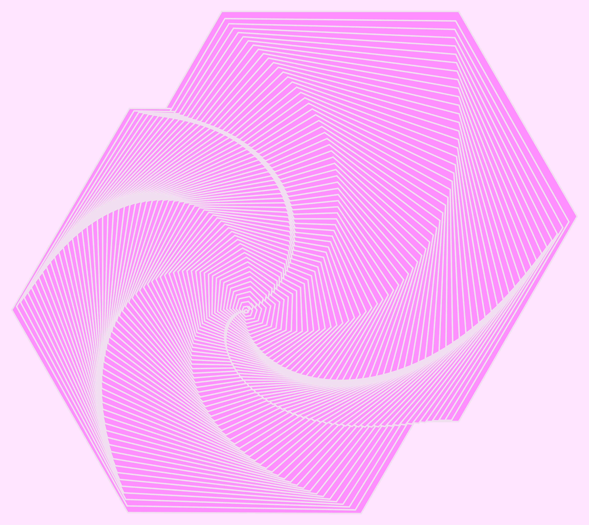
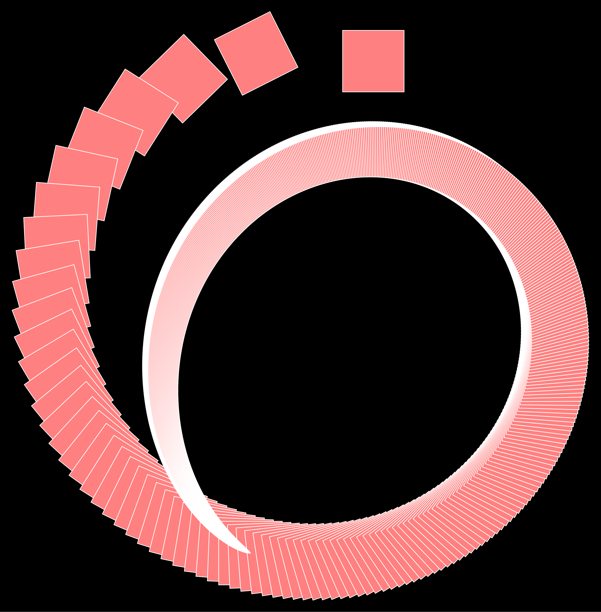
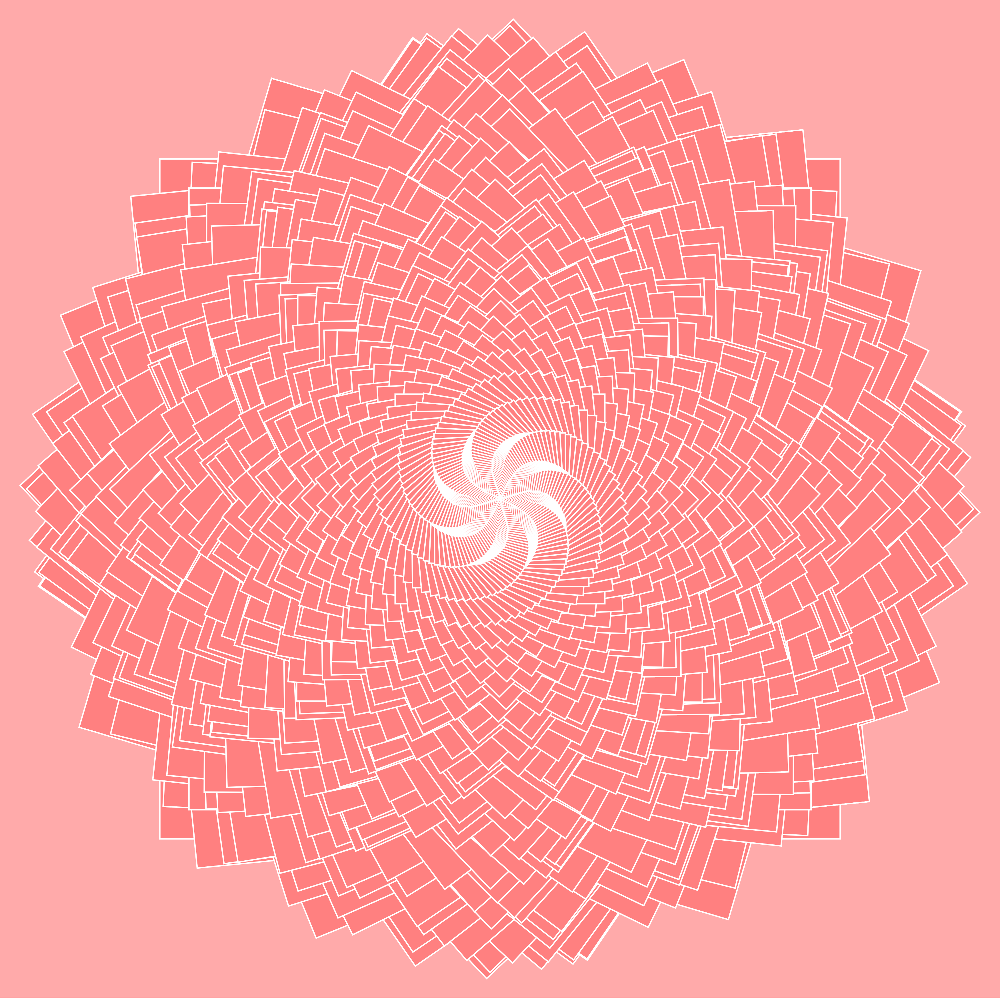
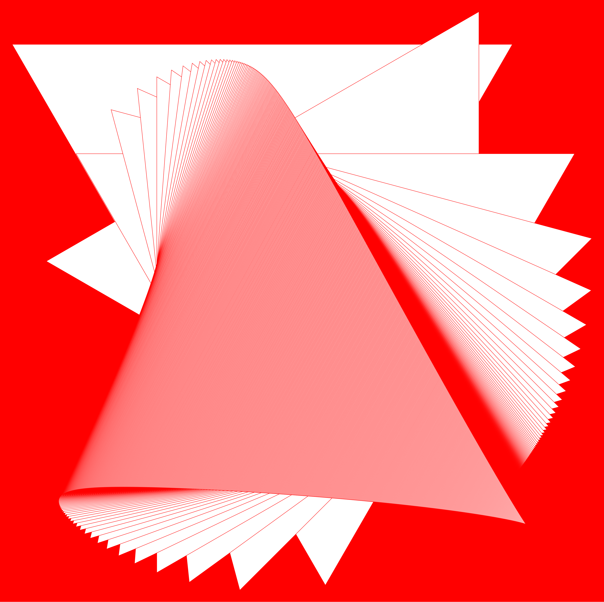

#geometric art with Wolfram Mathematica

A small set of files that can be used to produce various geometric art forms.
Extensible and customizable; a large number of art-generating input parameters leads to unexpectedly beautiful images!

In addition to controlling polygons used and coloring, there is control over rotation rate and relative scaling inputs.

Some examples generated with this code:

